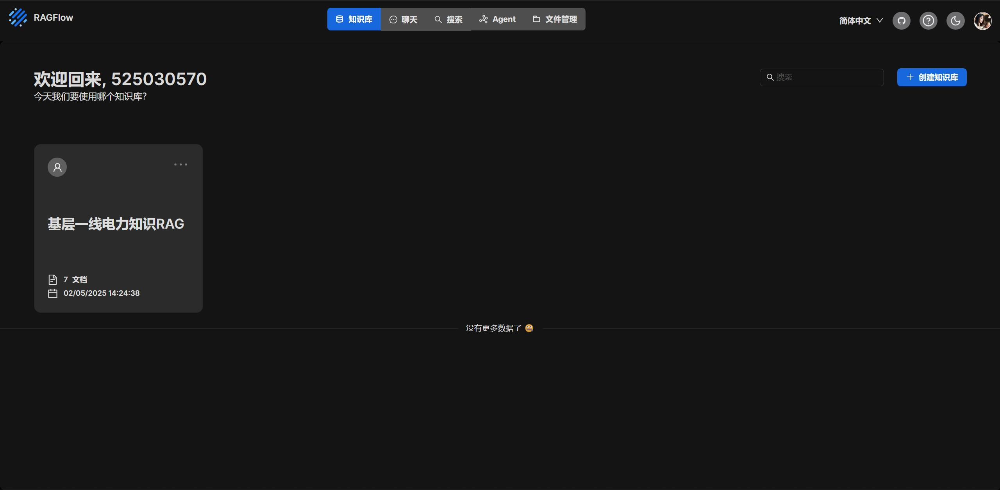
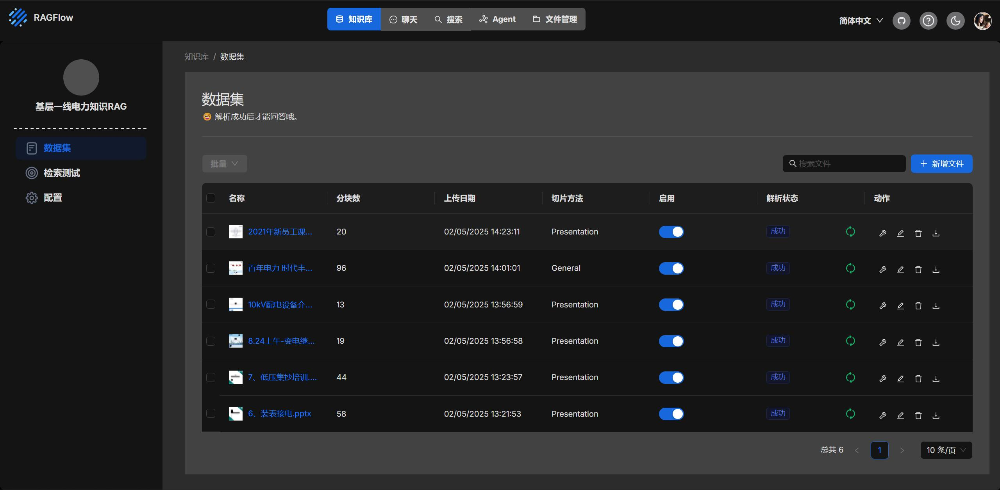
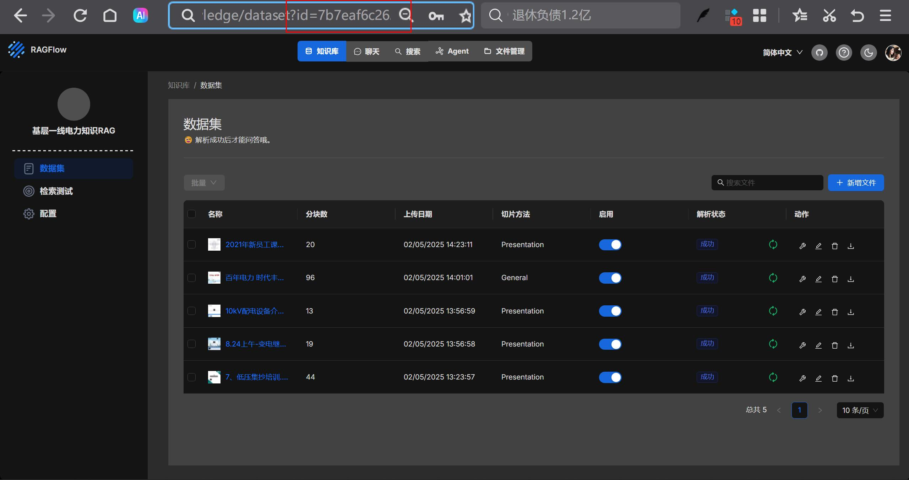
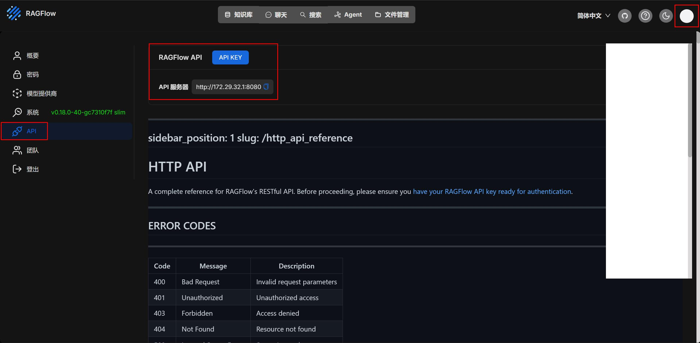
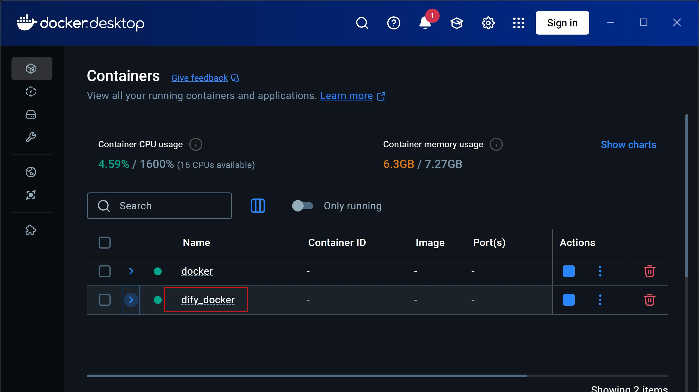
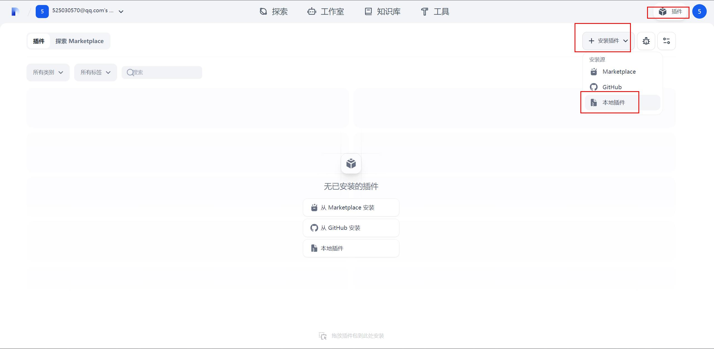
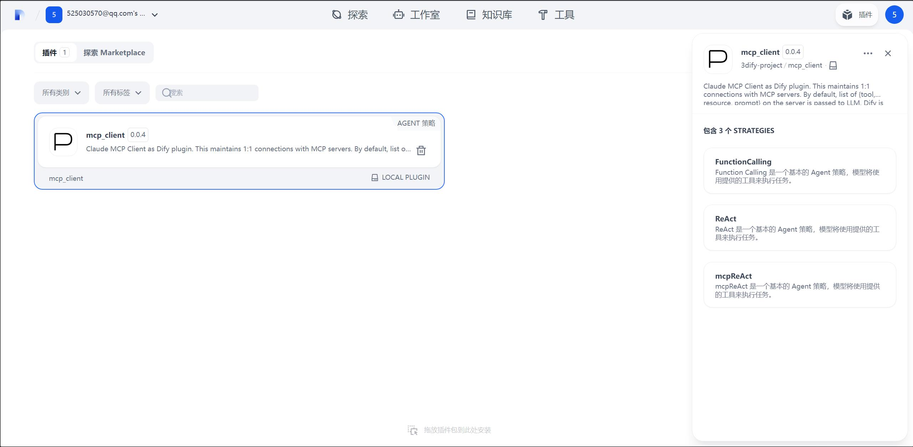
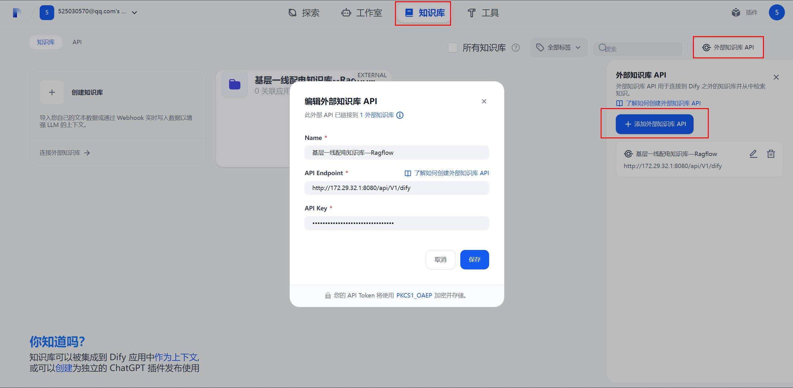
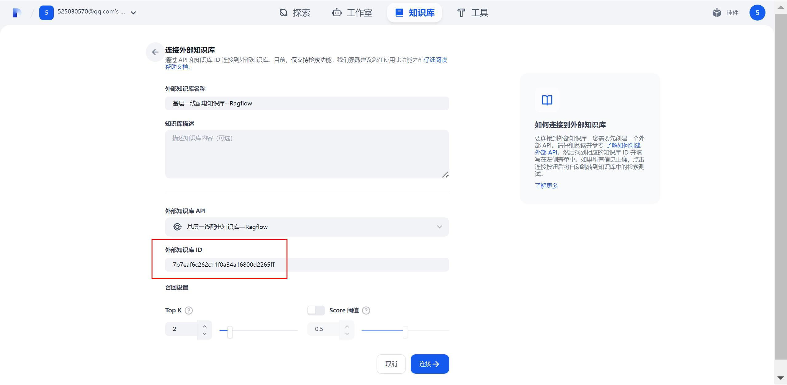
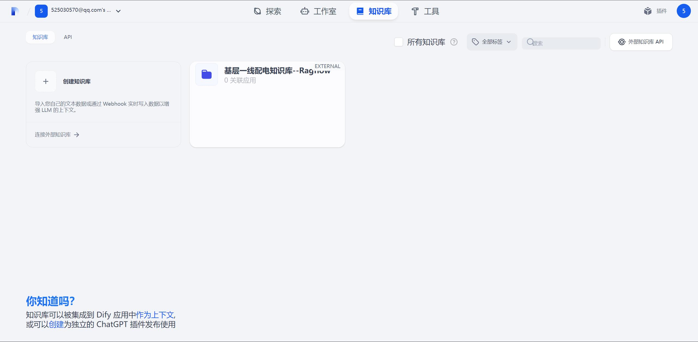

# Power Brain：Ragflow + dify 构建基层供电所超级大脑

本人曾经是一名偏远乡镇供电所配电运维人员，深知一线工作繁杂琐碎，技术含量不高但又重复性高的简单工作数不胜数。无数个日日夜夜里都在祈祷公司能够有先进的系统能够提高我们的工作效率，让我们免受折磨。不过，时至今日，原单位也没有这样的系统。现在，我就我曾经的一线电力工人的实际感受结合现在的AI大模型新技术来构思一套一线工程师能用的解决方案。

本项目试图寻找到一种能够方便工程企业基层一线员工利用大模型技术提升工作效率，降低工作负担，推动AI大模型技术在生产一线快速落地的解决方案。本项目采用ragflow开源框架作为企业知识库搭建平台，低代码开发框架dify作为AI大模型工作流创建与开发框架，构建适合企业一线生产环境的AI大模型应用平台。

## 项目目标

部署ragflow创建管理企业私有知识库

Dify调用ragflow创建的知识库

Dify和ragflow相互独立便于迭代升级

Dify接入MCP服务器

整个AI大模型应用平台简单易上手，传统企业一线员工也能够快速上手

## 一、	部署条件

安装docker，拉取ragflow和Dify的文件

docker https://www.docker.com/

ragflow https://github.com/infiniflow/ragflow

dify https://github.com/langgenius/dify

## 二、	修改ragflow docker compose配置

修改端口：

打开拉取到本地的./ragflow/docker/docker-compose.yml文件

找到端口部分
```yaml
ports:
      - ${SVR_HTTP_PORT}:9380
      - 80:80
      - 443:443
      - 5678:5678
      - 5679:5679
      - 9382:9382 
```
修改为
```yaml
ports:
      - ${SVR_HTTP_PORT}:9380
      - 8080:80     #修改为8080
      - 8443:443    #修改为8443
      - 5678:5678
      - 5679:5679
      - 9382:9382 
```
避免与Dify端口冲突

其余的部署步骤按照官方文档进行即可，有需要可自行寻找镜像源，yml文件里面的镜像名称需要根据镜像源同步进行修改。

启动方法

```
$ cd ./ragflow/docker
$ docker compose -f docker-compose.yml up -d
```
创建知识库


记录下知识库的id，后面使用Dify调用ragflow知识库时需要用到

点击头像所在位置，接着点击API，然后创建API Key，记录key和服务器端口。


## 三、	修改dify docker compose配置
### 1. 同时部署dify和ragflow
启动项目时注意要显示指定dify的项目名称，与ragflow项目隔离。因为两个项目的docker-compose.yml文件都在docker目录下。
```
docker compose -p dify_docker up
```

如图所示创建为两个项目，如果不修改名字则会创建为一个项目。

dify默认端口为80，记得前文修改ragflow端口，否则会冲突。

### 2. dify安装MCP Client

1. 构建docker镜像

      在dify/docker目录下创建Dockerfile文件，内容如下：
      ```
      FROM langgenius/dify-plugin-daemon:0.0.9-local

      # 安装node.js环境
      RUN curl -fsSL https://deb.nodesource.com/setup_22.x | bash -
      RUN apt-get install nodejs -y

      # 安装npm包管理器
      RUN curl -ql https://www.npmjs.com/install.sh | sh
      RUN npm config set registry https://registry.npmmirror.com/
      ```
      构建镜像：
      ```
      docker build -t dify_plugin:latest .
      ```
2. 修改配置文件

      修改环境变量文件.env
      
      在dify/docker目录下找到.env文件，找到    FORCE_VERIFYING_SIGNATURE参数，将值改为false
      ```
      FORCE_VERIFYING_SIGNATURE=false
      ```
      修改docker-compose.yaml文件

      在dify/docker目录下找到docker-compose.yaml文件，找到plugin_daemon部分，修改为刚创建的镜像：
      ```yaml
      plugin_daemon:
      image: dify_plugin:latest # 修改为刚创建的镜像
      restart: always
      ```
      完成修改后保存文件，重启dify服务
      ```
      docker compose -p dify_docker up -d
      ```
## 四、	安装MCP Client

下载MCP Client，自行搜索或者参考以下链接：
```
https://github.com/3dify-project/dify-mcp-client
```
启动dify服务后，点击插件、安装插件、本地插件，如图所示

选择下载的MCP Client

安装好后如图所示：


后续可以在dify的项目中接入MCP服务器

## 五、dify接入ragflow知识库
启动docker后进入知识库界面，点击外部知识库API，点击添加，如图所示：


Name自行设置

API Eendpoint填写ragflow服务器地址，如http://172.29.32.1:8080/api/v1/dify

API Key填写ragflow服务器的API Key

填完点保存

随后连接外部知识库，如图所示：


外部知识库ID填写前文中记录下来的ragflow知识库ID即可。


      
外部知识库接入成功。


## 六、后续计划

未来打算在此基础上为ragflow接入MinerU，为dify接入一些好用的MCP服务器或者开源框架，比如PlayWright、Firecrawl、自动生成word\excel\PPT的MCP服务器，做一个传统行业底层一线工程师的智能助手。


